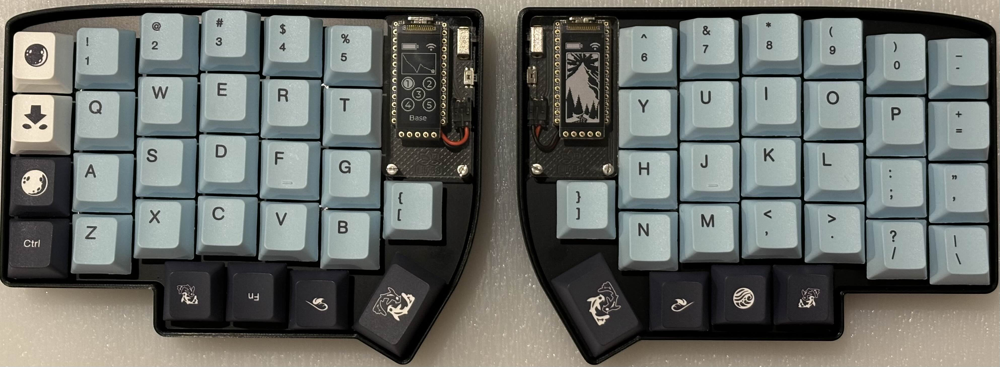
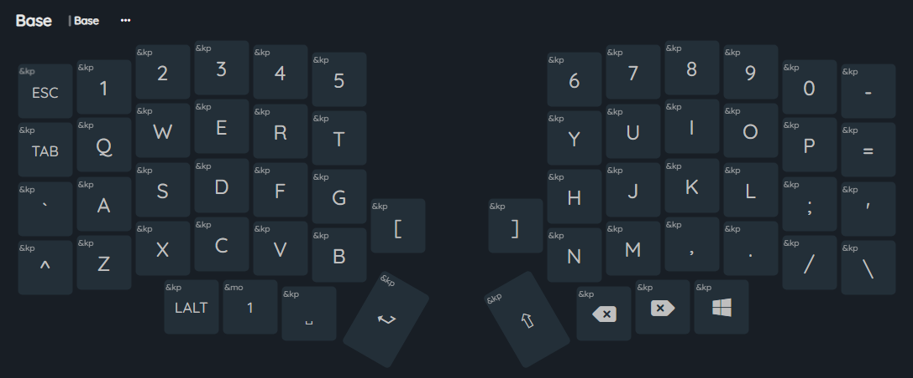
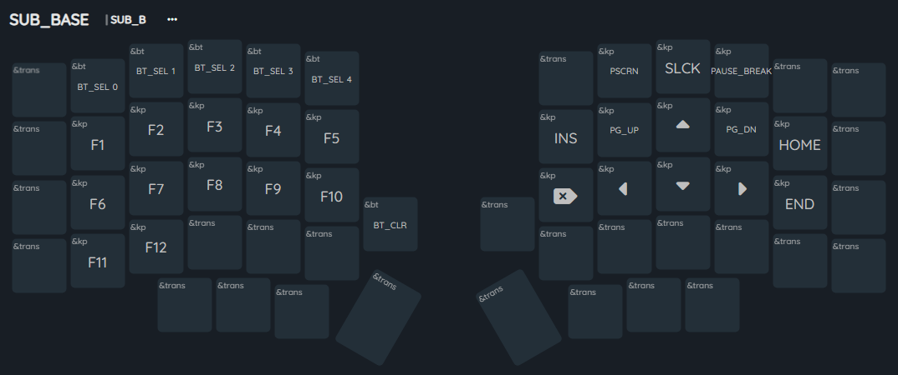
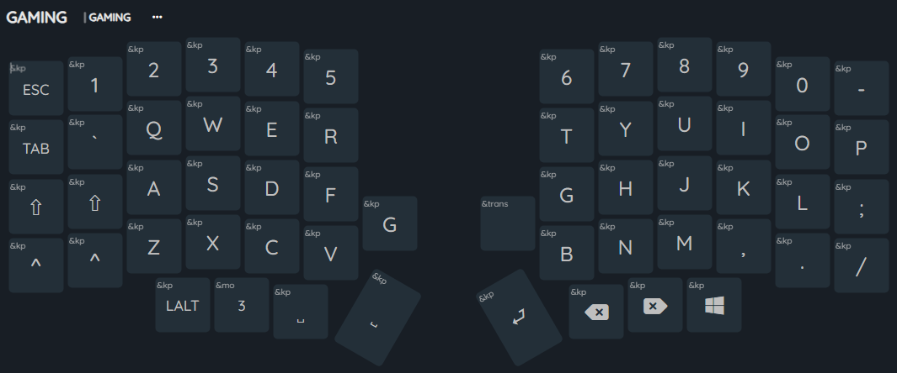
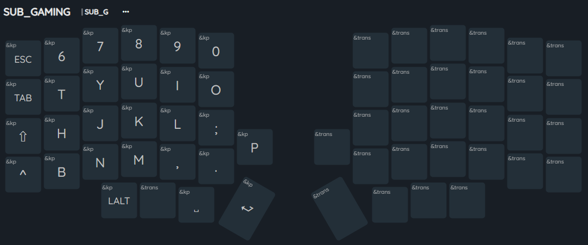

# Lily58 Wireless Keyboard

This repository contains the ZMK firmware configuration for my Lily58 wireless keyboard. The Lily58 is a split ergonomic mechanical keyboard with wireless capabilities, customized with Durock T1 Silent Shrimp switches and JSJT Sky and Blue Keycaps.

## All Items
- **PCB** - [Lily58 Wireless Partially Assembled PCB](https://typeractive.xyz/products/lily58-partially-assembled-pcb)
- **Controller** - [nice!nano v2.0 Wireless Microcontroller](https://typeractive.xyz/products/nice-nano)
- **MX Switches** - [Durock T1 Silent Shrimp switches](https://www.amazon.ca/dp/B0BFQQJNX5)
- **Cherry Profile Keycaps** - [JSJT Sky and Blue Keycaps](https://www.amazon.ca/dp/B0B1D57TJY)
- **Case** - [Basic 3D Printed Case + FR-4](https://typeractive.xyz/products/lily58-case?variant=47879038566631)
- **Screen** - [nice!view Screen](https://typeractive.xyz/products/nice-view)
- **Batteries, one for each side** - [Lithium Battery 110mAh](https://www.aliexpress.us/item/1005005348368664.html?gatewayAdapt=4itemAdapt)

Most of the items were purchased from [Typeractive](https://typeractive.xyz).

## Layers and Keymap
This configuration uses ZMK firmware to manage multiple layers and custom keymaps. Below are the details of each layer along with screenshots.

### Base Layer
The base layer includes most of the keys found on a 60% mini keyboard. It also has a sub-layer accessed via the holding a "FN" key, which includes all other missing keys such as F1-12, arrow keys, home keys, and Bluetooth settings.

#### Base Layer

#### Sub Base Layer

### Gaming Layer
The gaming layer is toggled by pressing a combination of the "[" and "]" keys, located just under the screen on each side of the keyboard. To switch back, simply press the same key combo. The layout itself is shifted to the right by one key to ensure the correct fingers are on the **WASD** keys. This layer also has an additional sub-gaming layer for quick access to other parts of the keyboard without needing to move your hands away from the mouse.

#### Gaming Layer

#### Sub Gaming Layer

